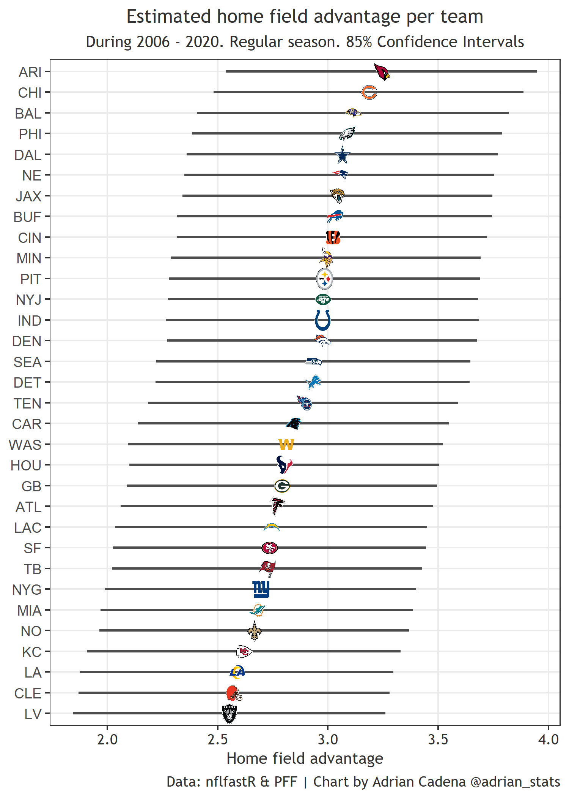

## Introduction
The sports betting industry and their enthusiasts continually try to find the correct value of a home field advantage (HFA) in terms of “point-spread” to create betting lines. In particular, NFL bookmakers tend to reward a home field with three points on average; this varies across different home teams per season. The idea is that playing at home is considered an advantage in the NFL, and some teams have a stronger HFA than others. Interested in this topic, I decided to use nflfastR and PFF data to quantify HFA advantage for the league and each team. I also leveraged the opportunity to analyze the behavior of HFA across seasons.

## League home field advantage vs. team-specific home field advantage
Agreeing with consensus, I found the league home field advantage (LHFA) during 2006-2020 to be approximately three points (2.87). However, I found it to be fluid, so a 2.87 LHFA has not been true for every season during that period. In addition to LHFA, I calculated Team-Specific Home Field Advantage (iHFA), a concept suggested by  [Takoma Park](https://dartthrowingchimp.wordpress.com/2015/01/24/estimating-nfl-team-specific-home-field-advantage/). iHFA represents the additional or fewer points that each team has in terms of HFA compared to the league average. For example, the Ravens had an estimated iHFA of 0.26 points during 2006-2019; meanwhile, the Raiders had -0.37 points below league HFA.

When we add together LHFA and iHFA, we obtain the true HFA for each team. There have been seasons where iHFA is not statistically significant, meaning the difference in iHFA between teams is not meaningful. When that happens, each team receives an iHFA of zero, and their HFA equals the LHFA. iHFA is normally-distributed around a mean of zero during a given period. In other words, the positive and negative iHFA's for all teams add up to zero during the analyzed period.

Evidence suggests that LHFA has been shrinking, and iHFA is volatile and unpredictable year over year. These findings are consistent with [Robby Greer's](https://www.nfeloapp.com/analysis/an-initial-exploration-of-home-field-advantage-in-the-nfl).

## Adjusting home field advantage

When thinking about strong home fields, most people think about Seattle, Pittsburgh, New Orleans, etc. However, such perceptions are biased by the success that those teams have had regardless of their home/away status. Suppose we were to build a model using only home_team and away_team as variables. With that approach, we would end up with the expected teams at the top (NE, PIT, SEA, etc.), similar to common perception. However, this methodology is flawed since our results would capture team strength rather than an HFA. The way to get the real value of a home field is by controlling for variables such as:

-	Strength of team and opponent

-	Competence of the head coach and opposing head coach

-	Quarterback and opposing quarterback performance

-	How each team performs home vs. away

After adjusting for the listed variables, I found the real value of LHFA and iHFA. Unsurprisingly, these adjustments decreased iHFA for teams with successful head coaches and elite quarterbacks like NE, NO, and SEA. Overperformance by weak teams, bad QB’s, and incompetent HC’s is then explained by the home/away variable. A chart displaying HFA for each team, along with confidence intervals, during 2006-2020 is presented below.

