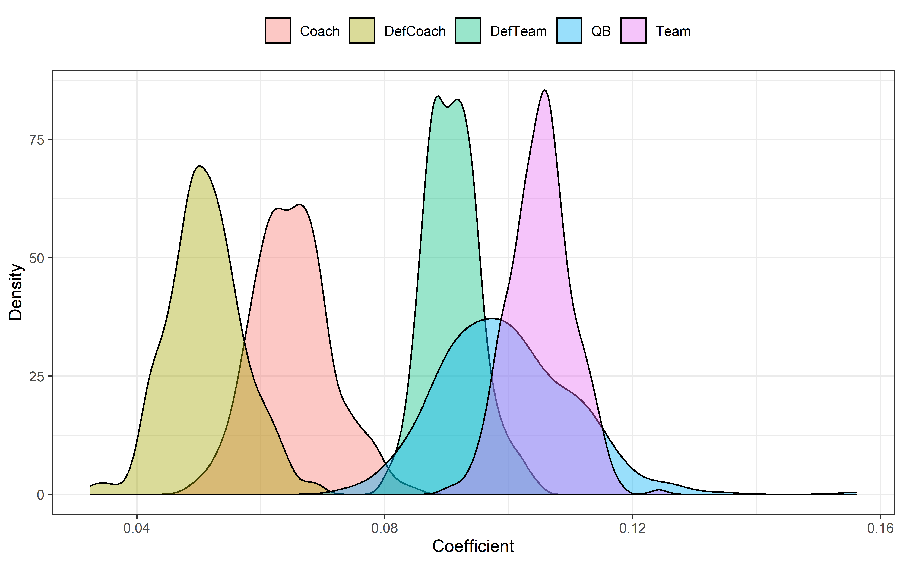

<style type="text/css">
  body{
  font-size: 13pt;
}
h1.title {
  font-size: 1px;
}
</style>


# Intro
This is a "test" post that I decided to use to show people how I create HTML-format posts using R Markdown. People can follow the source code [here](https://github.com/adriancm93/website/blob/master/content/post/qb/index.Rmd).

# Metadata and format

This is the YAML front matter.  Add this to line 1, including the ```---``` at start and end.

```
---
author: "Adrian Cadena"
date: "11-22-2020"
repository_url: https://github.com/adriancm93/mixed_effects_bootstrapping

output:
  html_document:
    toc: yes
    toc_depth: '3'
    df_print: paged
  distill::distill_article:
    self_contained: no
    toc: yes
    toc_depth: 3
---
```
To format R code chunks, use this code add ``` ``` ``` at start and end:

```
{r setup, include=FALSE}
knitr::opts_chunk$set(
  echo = TRUE, 
  message = FALSE, 
  warning = FALSE, 
  dpi = 600, 
  tidy = 'styler'
  )

```

# Font

This is the code I used to set the font size, right after the front matter.
```
<style type="text/css">
  body{
  font-size: 14pt;
}
</style>

```

# Non-R code
To add non-R code without it being run, like I did with front matter and font matter, add ``` ``` ``` at the start and end of such code.

# R code

You can run R code by inserting R code chunks. Refer to my [source code](https://github.com/adriancm93/website/blob/master/content/post/qb/index.Rmd).

You can change each block of code's configurations by clicking on the engine icon on the top-right of the block. Show output only, show code and output, show nothing (run code), show nothing (don't run code). If you want to show R code without running it, just use the ``` ``` ``` method we did earlier.


**R code not to run**
```
seasons <- 2000:2019
pbp <- purrr::map_df(seasons, function(x) {
  readRDS(
    url(
      glue::glue("https://raw.githubusercontent.com/guga31bb/nflfastR-data/master/data/play_by_play_{x}.rds")
    )
  )
})
```

**R code to run**
```{r}
print("This is a code block")
```

You can print **tables** and **plots**:

**Table**

```{r}
library(ggplot2)
library(dplyr)
qb <- data.frame(coef = readRDS('passer1.rds'),effect='QB')
team <- data.frame(coef = readRDS('team1.rds'),effect='Team')
coach <- data.frame(coef = readRDS('poscoach1.rds'),effect='Coach')
defteam <- data.frame(coef = readRDS('defteam1.rds'),effect='DefTeam')
defcoach <- data.frame(coef = readRDS('defcoach1.rds'),effect='DefCoach')

plot2 <- rbind(qb,team,coach,defteam,defcoach)

plot2 %>% head()
```

**Plots**
```{r include=FALSE}
library(ggplot2)
qb <- data.frame(coef = readRDS('passer1.rds'),effect='QB')
team <- data.frame(coef = readRDS('team1.rds'),effect='Team')
coach <- data.frame(coef = readRDS('poscoach1.rds'),effect='Coach')
defteam <- data.frame(coef = readRDS('defteam1.rds'),effect='DefTeam')
defcoach <- data.frame(coef = readRDS('defcoach1.rds'),effect='DefCoach')

plot2 <- rbind(qb,team,coach,defteam,defcoach)

ggplot(plot2,aes(x=coef,fill=effect))+
  geom_density(alpha=.4)+
  theme_bw()+ 
  theme(legend.position = 'top',
        legend.title = element_blank())+
  labs(x='Coefficient', y='Density') + ggsave('plot.png',dpi=600, width = 8, height = 5, units = "in")
```



# Insert images

You can also insert images using the following code. Don't add it to a code block.

```

```

Result:


# Convert to HTML
Click on "Knit" and select Knit to HTML. 

